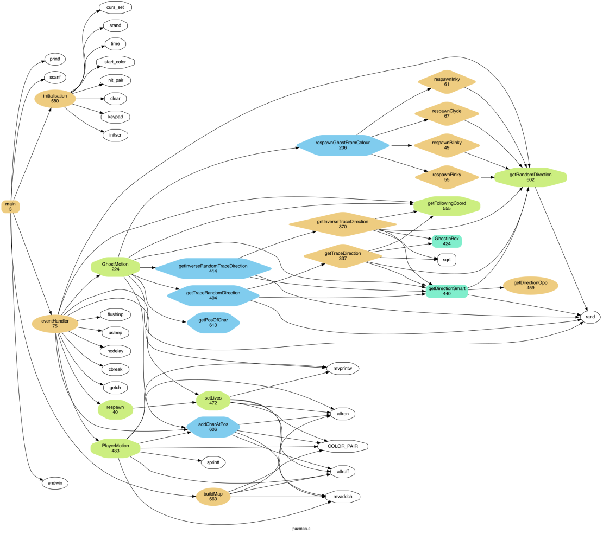

Architecture Document
=========================================
Project structure
----------------------
- `pacman.c`
- `pacman.h`
- `PACMAN.md`
- `ARCHITECTURE.md`
- `image`
    - `pacmanScreenshot.png`
    - `CallDiagram.png`
- `Makefile`
- `README.md`

Stucture of **pacman.c**
----------------------

**Characteristics of the game:**

- char c: directional key
- int score: every time the pacman eats a pellet or an enemy this increments.
- int remainingPellets: numbers of pellets remaning
- int dead: is 0 as long as the player or a ghost is not dead and is 1 when they are
- int win: is at 0 as long as the player is not dead and is at 1 when he is dead
- int lives: number of lives pacman have, 3 by default.

**Player data:**

- int playerY: y positions of pacman
- int playerX: x positions of pacman
- int playerDirection: last direction of pacman
- int PowerPellet: big Pellet allowing pacman to eat the ghosts
- int PelletCounter: time when the PowerPellet is activated

**Ghost data:**

- int blinkyY: y actual positions of Blinky Ghost.
- int blinkyX: x actual positions of Blinky Ghost.
- int blinkyDirection: actual direction where Blinky Ghost is moving.
- int pinkyY: y actual positions of Pinky Ghost.
- int pinkyX: x actual positions of Pinky Ghost.
- int pinkyDirection: actual direction where Pinky Ghost is moving.
- int inkyY: y actual positions of Inky Ghost.
- int inkyX: x actual positions of Inky Ghost.
- int inkyDirection: actual direction where Inky Ghost is moving.
- int clydeY: y actual positions of Clyde Ghost.
- int clydeX: x actual positions of Clyde Ghost.
- int clydeDirection: actual direction where Clyde Ghost is moving.
- int vulnerable: is at 0 when the ghost is not vulnerable, when a PowerPellet is eaten, it is set to 1, so it becomes vulnerable.

**Map:**

- int logicalMap[][XSIZE]: pacman map
- int ghostMap[][XSIZE: ghost map

**Free Lab Bonus**

- int direction: ghost direction
- int ghostY: y actual positions of ghost.
- int ghostX: x actual positions of ghost.
- int playerY: y actual positions of pacman.
- int playerX: x actual positions of pacman.
- int logicalMap[][XSIZE]: pacman map

For this bonus we have implemented functions depending on the vulnerability of the ghosts. When they are not vulnerable, with the functions `getTraceDirection` and `getTraceDirection`, the ghosts will try to find the distance x, y between the player and themselves, if they don't find it, they return to move randomly. 

If they find the distance, thanks to the function `getTraceRandomDirection` the ghost will get the direction of pacman with 2 chances on 3, if not, they go back to a random direction.

When they are vulnerable, with the function `getInverseRandomTraceDirection`, the ghosts run away from the pacman with a probability of 2/3, with the 1/3 of probability they get a random direction.

Call Diagram
----------------------

This diagram shows the organization of the execution of our pacman.c file.
First, main calls two main functions: `EventHandler` and `initialisation`. `initialisation`, initializes the variables to run the map. `EventHandler` collects new inputs and directs where to send data. 

More precisely, it initializes the game characteristics, player and ghost data. This function also keeps the game running until the player leaves the game, spawns the player with ghosts, calls the `GhostMotion` and `PlayerMotion` functions to randomly set the ghosts in motion and the player to move.

It also tests if the player has any lives left, if he has won or lost and if the ghosts are dead, in which case it makes calls to the various `Respawn` functions to respawn the ghosts.

