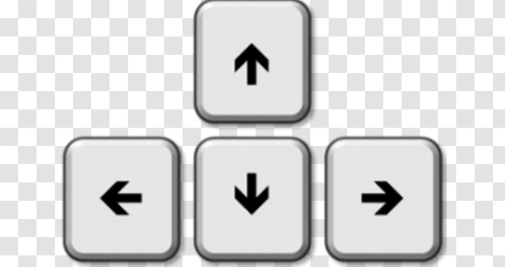

# Pacman

This is an implementation of the original PacMan game using a multithreaded approach.
Each enemy is an independent thread and the number of enemies is configurable.


## Tech Stack

The project was built using C by displaying the game in the terminal.

## Technical Requirements

* The game's maze layout can be static.
* The pacman gamer must be controlled by the user.
* Enemies are autonomous entities that will move a random way.
* Enemies and pacman should respect the layout limits and walls.
* Enemies number can be configured on game's start.
* Each enemy's behaviour will be implemented as a separated thread.
* Enemies and pacman threads must use the same map or game layout data structure resource.
* Display obtained pacman's scores.
* Pacman loses when an enemy touches it.
* Pacman wins the game when it has taken all coins in the map.

## System Requirements

This project uses C, you'll need to have installed:

* [C](https://docs.microsoft.com/en-us/cpp/build/vscpp-step-0-installation?view=msvc-170) version C.17 or above
* C compiler (Only if you are using MacOS or Linux)
* Depending on which platform you are using, you might need to install some extra dependencies.

* Watch out : About library we are using [OpenMP](https://www.openmp.org) and [curses](https://pubs.opengroup.org/onlinepubs/7908799/xcurses/curses.h.html). Be careful if you are using another system.

> We tested the project in MacOS and Ubuntu.

## Build/Run

### First build, then run

To build the executable, run:

```bash
$ make pacman
```

Then, run it with:

```bash
$ ./pacman
```

To specify the number of enemies this message will appear in the terminal:

```bash
$ How many ghosts do you want to fight?
$ Please type a number between 1 and 6 : 
 ```

> The maximum number of enemies allowed is 4 because the game becomes too difficult afterwards.

## Keys to play PacMan

> In order to move PACMAN you have to use the directional keys (UP, DOWN, LEFT, RIGHT)



## Architecture

Visit the architecture document [here](./ARCHITECTURE.md).

## Video Presentation

You can check out the video [here](Put the video here).